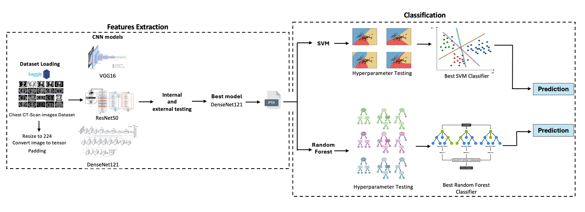

# Comparative Analysis of Supervised Learning Algorithms for Lung Cancer Classification in CT Imaging
This repository contains the implementation and documentation

## Background
Lung cancer is a leading cause of cancer-related deaths, accounting for 1.8 million annual fatalities. Early detection using CT imaging is crucial, but interpretation is challenging due to variability in pathology. This project explores machine learning techniques, leveraging CNNs and classifiers like SVM and Random Forests, to classify lung cancer from CT scans. By benchmarking models based on accuracy, precision, and recall, the research aims to identify optimal solutions for automated lung cancer detection, supporting clinicians in early diagnosis and treatment planning.
## Architecture


## Repository Structure

- `Classification/`: Classification Random Forest model and SVM Model
- `Dataset/`: This folder contains image examples for training dataset and testing dataset
- `Main Code/`: Main Code including all parts (Train and evaluate all models,Test the models on the test set,Visualization, and Classification )
- `Test the models on the test set/`: Test the models on the test set and save the best model
- `Train and evaluate all models`: Train and evaluate all models, get the best model and its name
- `Visualization/`: View dataset samples
- `README.md`: Overview and setup instructions.
- `requirements.txt`: Required libraries for the project.


## Install Requirements
Clone this repository and install the required Python packages:

```bash
git clone https://github.com/ZainabAldhanhani/LungCancerClassificationA701.git
cd LungCancerClassificationA701
pip install -r requirements.txt
```
## Implement The Full Pipeline  
```bash
cd 'Main Code'
python main.py 
```
## View Dataset Samples
```bash
cd visualization
python visualization.py --dataset_path Path
```
## Train and Evaluate All models
```bash
cd 'Train and evaluate all models'
python crossValidateTrain.py --train_dataset_path Path1 --test_dataset_path path2
```
## Test The Models on The Test Set And Save The Best Model
Model Weights are required in this step. Do the Train Step OR Download the weight that provided in this repository. 
```bash
cd 'Test the models on the test set'
python testDatasetonEachModel.py --train_dataset_path Path1 --test_dataset_path path2
```
> **Note**: Make sure that Model Weights in the same folder.

## Classification
For Random Forest: 
```bash
cd Classification
python RandomForest.py --train_dataset_path Path1 --test_dataset_path path2 --model_name model_name
```
For SVM: 
```bash
cd Classification
python SVM.py --train_dataset_path Path1 --test_dataset_path path2 --model_name model_name
```
> **Note**: Make sure that Model Weights in the same folder.
## Dataset Access

The dataset used for this project is available on Kaggle. It contains Chest CT scan images for  3 chest cancer types which are Adenocarcinoma,Large cell carcinoma, Squamous cell carcinoma , and 1 folder for the normal cell.
To access and download the dataset, follow these steps:

1. Visit the Kaggle dataset page: **[Chest CT Scan Images](https://www.kaggle.com/datasets/mohamedhanyyy/chest-ctscan-images)**
2. Click on the "Download" button to download the dataset manually, or use the Kaggle API to download it directly to your workspace.


## Model Weights

The model weights are hosted on OneDrive due to their large file size.  
You can download the weights by clicking the link:**[Access the Weights Here](https://mbzuaiac-my.sharepoint.com/:f:/g/personal/zainab_aldhanhani_mbzuai_ac_ae/EtPDUCWLWddDkByjxYZjfxEBpC48W00Wf9uM7ZPSXlO7qw?e=3M92mh)**

> **Note**: Make sure you have adequate storage space and a stable internet connection when downloading the files.

## Methodology
### Feature Extraction

- **Dataset Preparation:** Labeled images (four classes) resized to 224x224; split into internal and external datasets.  
- **Custom Dataset Class:** Handles image transformations (resizing, normalization, tensor conversion).  
- **Model Selection:** Pre-trained architectures (VGG16, ResNet50, DenseNet121) used; evaluated with 5-fold cross-validation.  
- **Testing:** Optimal model weights saved based on F1-score.  

### Classification Using Random Forests

- **Feature Extraction:** Features saved as `.pth` files to reduce complexity.  
- **Random Forest:** Used for classification due to robustness and interpretability.  
- **Grid Search:** 3-fold cross-validation identifies best hyperparameters (e.g., `n_estimators`, `max_depth`).  
- **Evaluation:** Metrics include accuracy, weighted F1-score, and a confusion matrix.  

### Classification Using Support Vector Machines

- **SVM Classifier:** Uses one-vs-one (OvO) method for multi-class classification.  
- **Parameter Tuning:** Kernel types and regularization parameters optimized with 5-fold cross-validation.  
- **Retraining:** Best SVM model trained on the full dataset for generalization.  

## Contributions
1. Provides a benchmark comparison of supervised algorithms for lung cancer classification in CT imaging, aiding early diagnosis and supporting timely treatment decisions.
    
2. Highlights the strengths and weaknesses of various algorithms, serving as a valuable educational resource for medical residents and professionals.
    
3. Addresses key challenges like data preprocessing and model generalizability, establishing a reliable benchmark that contributes to the development of trustworthy AI tools for clinical applications.

## Challenges and Future Directions


1. This study focuses on using CNNs for feature extraction and classification, excluding transformer-based architectures.
2. Transformer-based architectures, known for their strong potential in medical imaging, could provide additional insights.
3. The analysis relies on a single medical dataset, which may limit the generalizability of the findings.
### Future work could:
1. Incorporate transformers and hybrid models combining CNNs with transformers to enhance insights in lung cancer detection.
2. Expand the analysis to include multiple, diverse medical datasets to improve generalizability.
3. Evaluate performance across various image qualities and patient demographics
